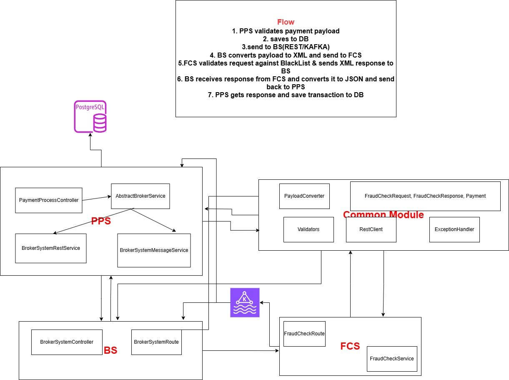
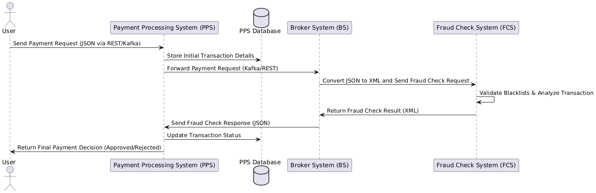

# Payment Processing System (PPS), Broker System (BS), and Fraud Check System (FCS)

This project includes three main components—**PPS (Payment Processing System)**, **BS (Broker System)**, and **FCS (Fraud Check System)**—which communicate using Kafka messaging, REST APIs, and Docker containerization.

---

## Technologies Used

- **Core Language**: Java
    - For application logic and business rules.
- **Integration Framework**: Apache Camel (or Spring Integration)
    - For routing, transformation, and messaging.
- **Messaging**: Kafka
    - For asynchronous communication between systems.
- **Data Formats**:
    - **JSON** for PPS ↔ BS communication.
    - **XML** for BS ↔ FCS communication.
- **REST API**: Spring Boot
    - For communication between PPS and BS.
- **Containerization**: Docker
    - Containerizes services for easy deployment.
- **Logging & Monitoring**: Logback
    - For centralized logging and monitoring.
- **Testing Framework**:
    - JUnit for unit and integration testing.
    - Camel testing for integration tests.

---
## High-Level Design (HLD) for Payment Processing System (PPS), Broker System (BS), and Fraud Check System (FCS)

### Assumptions
- This system doesn't validate Payer's or Payee's bank account information
- Transaction already exist which has to be validated
- It only updates payment on intermediate level assuming rest of the systems are in place
- **Broker System** only acts as a mediator between **PPS** and **FCS**
- **FCS** performs only black list validation

#### Components of PPS:
- **Payment API**: Exposes a RESTful API that accepts payment requests.
- **Payment Validator**: Validates the payment fields, such as country codes, currency codes, payment amount, etc.
- **Broker Service**: Handles the core logic of sending Fraud check request via REST/KAFKA
- **Payment Service: Processes payment with appropriate status
- **Camel Route**: Handles the response from **BS** and proceeds with request to **Payment Service for payment processing (approve or reject).

#### Responsibilities:
- Receive payment requests from clients (via REST API or Kafka).
- Validate the payment details.
- Communicate with **BS** for fraud checking.
- Receive fraud check results and proceed to either approve or reject the payment.

---

### 2. Broker System (BS)

#### Role:
The **Broker System (BS)** acts as a mediator between the **Payment Processing System (PPS)** and the **Fraud Check System (FCS)**. It converts payment requests to the appropriate format, sends fraud check requests to **FCS**, and handles responses from **FCS**.

#### Components of BS:
- **Fraud Request Converter**: Converts payment request (JSON from PPS) into a request format that **FCS** understands (XML).
- **Message Consumer**: Receives payment requests from **PPS**.
- **Message Producer**: Sends fraud check requests to **FCS** via Camel routes.
- **Response Converter**: Converts fraud check response from **FCS** (XML) into a JSON response that **PPS** can understand.
- **Fraud Checker**: Communicates with **FCS** to check for any fraudulent activity.

#### Responsibilities:
- Convert the payment request from JSON (PPS) to XML.
- Send the fraud check request to **FCS**.
- Receive fraud check results from **FCS**.
- Convert the fraud check results (XML) into JSON.
- Send the fraud check result back to **PPS**.

---

### 3. Fraud Check System (FCS)

#### Role:
The **Fraud Check System (FCS)** is responsible for analyzing the payment data and determining whether the payment is fraudulent or legitimate. This system checks multiple criteria like country codes, bank details, payer/payee names, and payment instructions against a blacklist or fraud detection algorithm.

#### Components of FCS:
- **Blacklist Validator**: Validates whether the payer or payee is on a blacklist or flagged as fraudulent.
- **Fraud Response Generator**: Generates a response based on the analysis and validation results.
- **Message Consumer**: Receives fraud check requests from **BS** via Kafka Camel roultes.
- **Message Producer**: Sends the fraud check result to **BS** in XML format.

#### Responsibilities:
- Perform fraud detection on payment data.
- Validate payment data against blacklists and fraud algorithms.
- Return the fraud check result (approval/rejection) to **BS**.

---

### High-Level Interaction Flow

The following interaction diagram outlines how the three components interact:

#### Step 1: Payment Request (PPS → BS)
- **PPS** receives a payment request (in JSON format) from a client via REST API or Kafka.
- **PPS** validates the payment details (e.g., currency, country code, etc.).
- If valid, **PPS** sends the payment details to **BS** (in JSON format).

#### Step 2: Fraud Check Request (BS → FCS)
- **BS** receives the payment details from **PPS** and converts it into the XML format required by **FCS**.
- **BS** sends the fraud check request to **FCS** via Kafka routes.

#### Step 3: Fraud Check Response (FCS → BS)
- **FCS** receives the fraud check request in XML format and analyzes the payment details.
- **FCS** checks the payment against blacklists.
- **FCS** sends the fraud result back to **BS** in XML format.

#### Step 4: Fraud Check Response (BS → PPS)
- **BS** receives the fraud check response from **FCS**.
- **BS** converts the fraud response (from XML to JSON).
- **BS** sends the fraud check result back to **PPS**.

#### Step 5: Payment Processing (PPS)
- **PPS** receives the fraud check result.
- **PPS** processes the payment based on the fraud check result (approve or reject).

---

## High-Level Architecture Diagram:

```plaintext
 +---------------------+            +---------------------+            +---------------------+
 |     PPS (Payment    |  <--->    |     BS (Broker      |  <--->    |     FCS (Fraud      |
 |     Processing      |            |     System)         |            |     Check System)   |
 |     System)         |            |                     |            |                     |
 +---------------------+            +---------------------+            +---------------------+
         |                               |                               |
         | 1. Receive Payment Request    | 3. Send Fraud Check Request   | 5. Return Fraud Result
         | 2. Validate Payment            | 4. Receive Fraud Check Result | 6. Perform Fraud Check
         |                               |                               |
         |                               |                               |
 +---------------------+            +---------------------+            +---------------------+
 |     Client Request  |            |     Kafka Queue      |            |     Blacklist       |
 |     (JSON)          |            |     (Asynchronous)   |            |     Validator   |
 +---------------------+            +---------------------+            +---------------------+
```
## UML Design
### Component Design
```markdown

Refer fraudcheckcomponents.jpg) in root folder
```

```markdown

Refer components-communication.png in root folder
```

```uml

@startuml
actor User

participant "Payment Processing System (PPS)" as PPS
database "PPS Database" as DB
participant "Broker System (BS)" as BS
participant "Fraud Check System (FCS)" as FCS

User -> PPS: Send Payment Request (JSON via REST/Kafka)
PPS -> DB: Store Initial Transaction Details
PPS -> BS: Forward Payment Request (Kafka/REST)
BS -> FCS: Convert JSON to XML and Send Fraud Check Request
FCS -> FCS: Validate Blacklists & Analyze Transaction
FCS -> BS: Return Fraud Check Result (XML)
BS -> PPS: Send Fraud Check Response (JSON)
PPS -> DB: Update Transaction Status
PPS -> User: Return Final Payment Decision (Approved/Rejected)

@enduml

```
---

## Project Structure


- **paymentsystem**: Contains shared utilities and classes used by PPS, BS, and FCS.
- **paymentprocessor**: Payment Processing System (PPS) service.
- **brokersystem**: Broker System (BS) service.
- **fraudchecksystem**: Fraud Check System (FCS) service.

---

## Setup Instructions

### Prerequisites

Ensure you have the following installed:

- **Docker**: Required to containerize the services.
- **Docker Compose**: Used to orchestrate the services (Postgres, Kafka, Zookeeper).

### Building the Services

1. Clone the repository:
   ```bash
   git clone https://github.com/parmii/fraud-check-system.git
    cd fraud-check-system

### Installing necessary tools for system   
Run the following command to start all services:
   ```bash
       docker-compose up
   ```   
### This command will start the following services:
- Postgres(Port: 5432)
- Kafka (Port: 9092)
- Zookeeper (Port: 2181)

### Building and starting PPS, BS and FCS service
Run below command and start the services in corrosponding folders
```bash
       cd paymentprocessor
       mvn clean install //for all services
       java -jar target/paymentprocessor-0.0.1-SNAPSHOT.jar
       
       cd ../brokersystem
       mvn clean install
       java -jar target/brokersystem-0.0.1-SNAPSHOT.jar
       
       cd ../fraudchecksystem
       mvn clean install
       java -jar target/fraudchecksystem-0.0.1-SNAPSHOT.jar
       
   ```

### Endpoint to hit Payment Processing API
```bash
Solution1: sends to BS via REST

curl --location 'http://localhost:8080/api/processpayment' \
--header 'Content-Type: application/json' \
--data '{
  "transactionId": "7ad56d9f-1710-48e0-ae05-3c65278f0970",
  "payerName": "John Doe",
  "payerBank": "Bank of America",
  "payerCountry": "USA",
  "payerAccount": "123456",
  "payeeName": "Jane Smith",
  "payeeBank": "BNP Paribas",
  "payeeCountry": "GBR",
  "payeeAccount": "789012",
  "paymentInstruction": "Loan Repayment",
  "executionDate": "2025-03-26",
  "amount": 1000.09,
  "currency": "USD",
  "createdTimetamp": "2025-03-26T12:00:00Z"
}
'


Solution 2: sends to BS via KAFKA(Camel Route)
curl --location 'http://localhost:8080/api/processpayment/message' \
--header 'Content-Type: application/json' \
--data '{
  "transactionId": "7ad56d9f-1710-48e0-ae05-3c65278f0970",
  "payerName": "John Doe",
  "payerBank": "Bank of America",
  "payerCountry": "USA",
  "payerAccount": "123456",
  "payeeName": "Jane Smith",
  "payeeBank": "BNP Paribas",
  "payeeCountry": "GBR",
  "payeeAccount": "789012",
  "paymentInstruction": "Loan Repayment",
  "executionDate": "2025-03-26",
  "amount": 1000.09,
  "currency": "USD",
  "createdTimetamp": "2025-03-26T12:00:00Z"
}
'

```


